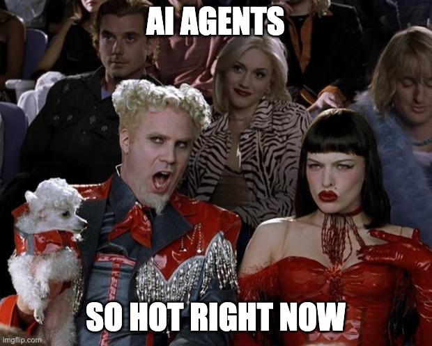
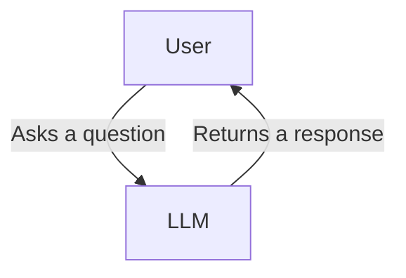
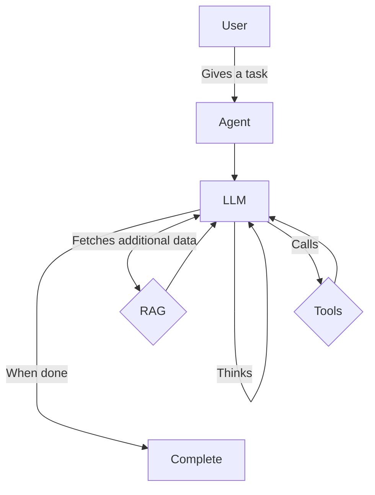
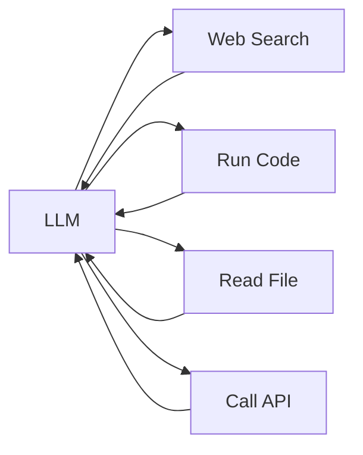
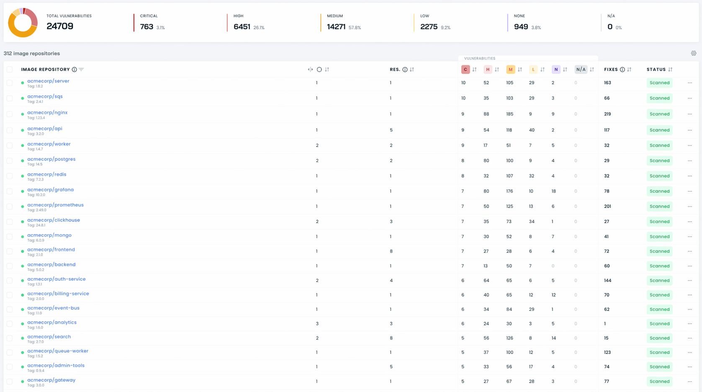
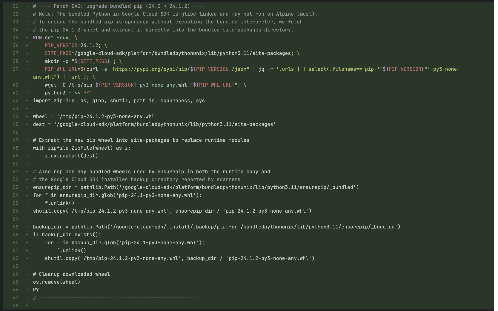
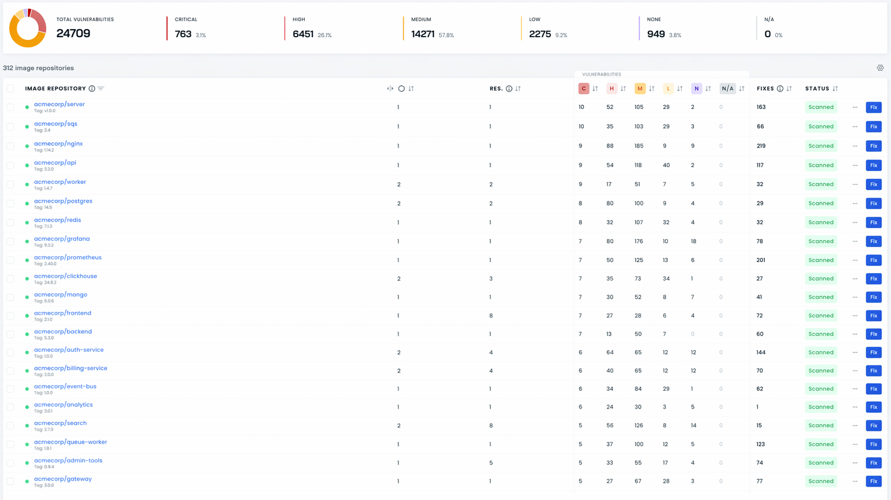
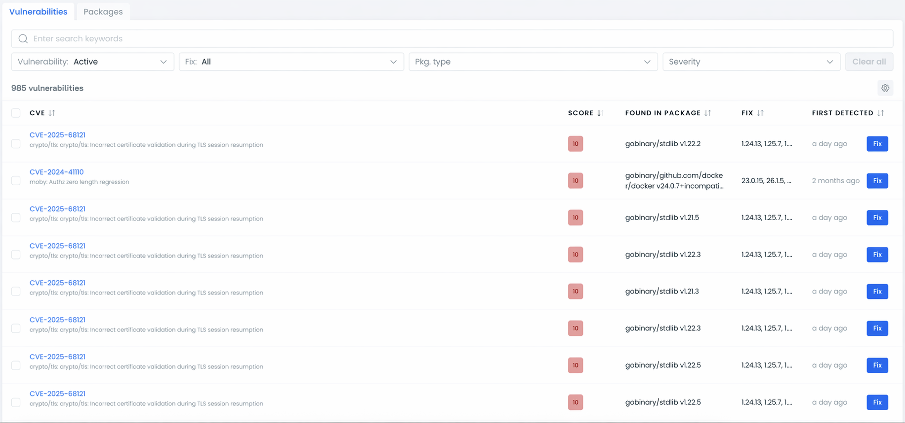

# Teaching AI to Fix Container Vulnerabilities

<div class="absolute bottom-10">
  <span class="font-700">
    Anton Sankov
  </span>
</div>

<style>
.slidev-layout.section h1 {
  font-weight: 700;
}
</style>

<!--
The last comment block of each slide will be treated as slide notes. It will be visible and editable in Presenter Mode along with the slide. [Read more in the docs](https://sli.dev/guide/syntax.html#notes)
-->

---
layout: full
---

<div class="grid grid-cols-[1fr_35%] gap-6" style="height: 100%">
<div>
  <div class="grid grid-rows justify-between" style="height: 100%">
  <div>
  
  # Anton Sankov
  ## Staff AI Engineer at Cast AI

  </div>

  - Doing Container Security stuff since 2020
  - Currently working on AI agents

    <br>
    <div>
      <h2> <ri-linkedin-box-fill/><span style="font-weight: normal;"> Anton Sankov</span> </h2>
      <h2> <mdi-web/><span style="font-weight: normal; padding: 0 0 0 6px">asankov.dev</span> </h2>
    </div>
  </div>
</div>
  <div>
    
  </div>
</div>

<style>
  .mr-14{
    width: 200px;
  }

</style>

---
layout: full
---

# Agenda

<div class="agenda-items">

1. What is an AI Agent
2. Attempt #1
3. Lessons Learned and Attempt #2
4. Will the AI Replace Us

</div>

<style>
.agenda-items {
  font-size: 1.4rem;
  line-height: 2.5rem;
}
.agenda-items ol {
  list-style-type: decimal;
  padding-left: 1.5rem;
}
</style>

---
layout: center
---

<div style="font-size: 2rem; text-align: center;">

**DISCLAIMER:**

This talk covers a commercial non-open source product.

This is not a sales pitch, it's just a knowledge and experience sharing session.

</div>

<style>
.slidev-layout p {
  line-height: 2rem;
  margin: 1rem 0;
}
</style>

---
layout: center
---



---
layout: full
---

# **What is an AI Agent?**

<div style="margin-top: 100px; text-align: center; font-size: 1.75rem;">

AI agents are software systems that use AI to pursue goals and complete tasks on behalf of users. 

They show reasoning, planning, and memory and have a level of autonomy to make decisions, learn, and adapt.

</div>

<Links :hrefs="['https://cloud.google.com/discover/what-are-ai-agents']"/>

<style>
.slidev-layout p {
  line-height: 2rem;
  margin: 1rem 0;
}
</style>

---
layout: full
---

# Chat vs Agent

## Chat

<div class="full-center">



</div>

<div style="position: absolute; bottom: 2rem; right: 2rem; font-size: 1rem;">
    <span style="font-weight: bold">Execution time:</span> 1 - 30 seconds
</div>

<style>

.slidev-layout p {
  line-height: 2rem;
  margin: 1rem 0;
}
</style>

---
layout: full
---

# Chat vs Agent

## Agent

<div class="full-center">



</div>

<div style="position: absolute; bottom: 2rem; right: 2rem; font-size: 1rem;">
    <span style="font-weight: bold">Execution time:</span> 5 - 60 minutes
</div>

---
layout: center
---

# Tools

An agent can call external tools to take actions or gather information.



---
layout: full
---

# The Problem

Endless lists of vulnerabilities



---
layout: full
---

# The Solution

<!--Build an AI agent that remediates security vulnerabilities (CVEs) in container images.-->

**Input:**
- container image
- git repository (where the source of the container image is)
- a list of vulnerabilities inside the container image
  - system (Linux packages, binaries, etc.)
  - application (Java/JS/Python/Go, etc. libraries and dependencies)
- credentials to external providers (container registries, artifactories, etc.)

**Expected output**:
- a Pull Request with changes that remediate vulnerabilities in that image

---
layout: full
---

# Attempt #1

Use multiple AI agents, but orchestrate everything in code

```python{1-23|2-3|5-6|8-9|11-12|14-18|20-23|1-23}
for image in vulnerable_images:
    # an AI agent that finds the Dockerfile in the code repo
    dockerfile = find_dockerfile(image.git_repo)
    
    # an AI agent that remediates vulnerabilities in system(OS) packages
    remediate_system_vulnerabilities(image.vulnerabilities, dockerfile)
    
    # an AI agent that finds the application dependencies file (package.json, pom.xml, build.gradle, etc.)
    dependency_file = find_dep_file(image.git_repo)
    
    # an AI agent that remediates vulnerabilities in the application dependencies
    remediate_application_vulnerabilities(image.vulnerabilities, dependency_file)
    
    # an AI agent that finds the build command and builds the image with the new changes
    # we do that for 2 reasons:
    # 1. to make sure the agent has not made some stupid change that breaks the build
    # 2. so that we can scan the new image and make sure we've fixed a good amount of vulnerabilities
    new_image = build_image(image.git_repo)
    
    # [deterministic] scan the newly build image
    scan_results = scan_image(new_image)
    
    # MORE DETERMINISTIC LOGIC - compare results, commit changes, open a PR, etc. ...
```

---
layout: full
---

# Attempt #1

Fallacies of that approach

Each one of these agents we invoke is a potential point of failure.
Upon failure of one agent, we failed the whole thing.
Probability of failure is:

<div style="font-size: 3rem;">

$$
1 - (1 - M)^N
$$

</div>

<div style="font-size: 1.1rem;">

where:

<div style="margin-top: -1rem;">

| | |
|---|---|
| **M** | probability of failure of 1 agent |
| **N** | number of agents |

</div>
</div>

---
layout: full
---

# Attempt #1

Fallacies of that approach

<div style="position: absolute; inset: 0; display: flex; flex-direction: column; align-items: center; justify-content: center; text-align: center; font-size: 3rem;">
<span style="font-weight: bold">
Sometimes the build would fail, <br> because of lack of resources
</span>

(looking at you, Java apps)

</div>

---
layout: full
---

# Attempt #1

Fallacies of that approach

<div style="position: absolute; inset: 0; display: flex; flex-direction: column; align-items: center; justify-content: center; text-align: center; font-size: 3rem;">
<span style="font-weight: bold">
The agent would produce changes for images that the users don't care about
</span>

</div>


---
layout: full
---

# Attempt #1

Fallacies of that approach

<div style="position: absolute; inset: 0; display: flex; align-items: center; justify-content: center; text-align: center; font-size: 2.5rem; font-weight: bold;">
Sometimes the agent would just produce nonsense
</div>

---
layout: full
---

# Attempt #1

Nonsense like this:



---
layout: full
---

# Attempt #1 Retrospective

Three main mistakes

<span style="color: red; font-weight: bold;">Mistake #1:</span> LLMs tend to overdo things, especially when given tasks that are not properly defined and scoped

<span style="color: red; font-weight: bold;">Mistake #2:</span> We were doing stuff which was not mandatory and could have been done on a best-effort basis

<span style="color: red; font-weight: bold;">Mistake #3:</span> We were treating all images as equal

---
layout: full
---

# Attempt #2

Consolidate logic into a self-orchestrating single AI agent with multiple tools

```python
for image in vulnerable_images:
    result = agent.run(prompt=f"""
    You are a security engineer tasked with remediating security vulnerabilities in a container image.
    
    You are given a git repo that contains the source code of a container image: {image_name}
    You are tasked with fixing the following vulnerabilities: {vulnerabilities}
    
    Use the provided tools to explore the repo and find relevant files 
    (Dockerfiles, application dependency files, etc.)
    
    Once you are done fixing, try to build the image to make sure you haven't broken anything.
    If building fails because of your changes, adapt them until the build is succesfull.
    If building fails for unrelated reasons, continue without building.
    
    If you're able to build the image, scan it to make sure the vulnerabilities are fixed.
""", tools=[
    read_file_tool,
    build_tool,
    scan_image_tool,
    open_pr_tool, ... # and more tools
], context={
    'image_name': image.name,
    'vulnerabilities': image.vulnerabilities.sort(key=lambda v: v.severity, reverse=True)[:10]
})
```

---
layout: full
---

# Attempt #2

Gave more control to the users

<div style="position: relative; height: 75vh;">
  
  
</div>


---
layout: full
---

# Attempt #2

Why this worked better

<div style="display: flex; flex-direction:column; padding: 0 0 2rem">
    <span>
        <span style="color: red; font-weight: bold;">Mistake #1:</span> LLMs tend to overdo things, especially when given tasks that are not properly defined and scoped
    </span>
    <span>
        <span style="color: green; font-weight: bold;">Solution:</span> Define the task better and limit the context given to the LLM
    </span>
</div>

<div v-click style="display: flex; flex-direction:column; padding: 0 0 2rem">
    <span>
        <span style="color: red; font-weight: bold;">Mistake #2:</span> We were doing stuff which was not mandatory and could have been done on a best-effort basis
    </span>
    <span>
        <span style="color: green; font-weight: bold;">Solution:</span> Recover from failures such as not being able to find a file or a failing build and continue executing the task
    </span>
</div>

<div v-click style="display: flex; flex-direction:column; padding: 0 0 2rem">
    <span>
        <span style="color: red; font-weight: bold;">Mistake #3:</span> We were treating all images as equal
    </span>
    <span>
        <span style="color: green; font-weight: bold;">Solution:</span> Give the user control over which images to fix
    </span>
</div>

---
layout: full
---

# Attempt #2

Lessons Learned

<div style="display: flex; flex-direction: column; gap: 1rem; margin-top: 2rem; font-size: 1.5rem; font-weight: bold">

<span>LLMs overthink and overdo stuff, but they can be prompted into doing the right thing.</span>

<span v-click>LLMs are resourceful and can find their way out of a problem if given enough freedom.</span>

<span v-click>This problem is as much technical as it is organizational.</span>

</div>

---
layout: full
---

# Will AI Replace Us?


<div v-click v-click-hide="2" style="position: absolute; inset: 0; display: flex; align-items: center; justify-content: center; font-size: 10rem; font-weight: 900; color: red; opacity: 0.9;">
  No.
</div>


---
layout: section
---

<div class="flex flex-col">

  # Thank you!
  
  # Questions?
  
  <div class="flex flex-rows justify-between mt-30px">
    <div style="text-align: right;">
      <h2> <ri-linkedin-box-fill/><span style="font-weight: normal;"> Anton Sankov</span> </h2>
      <h2> <mdi-web/><span style="font-weight: normal;">asankov.dev</span> </h2>
    </div>
    <div class="flex flex-col items-center">
      <div class="font-bold text-xl">Download the slides</div>
      
      <div class="font-bold text-xl"><a href="https://asankov.dev/go-generics">asankov.dev/go-generics</a></div>
    </div>
  </div>

</div>

<style>
h1 {
  margin: auto;
  padding: 15px 0;
}
h2 {
  padding: 5px 0;
}
</style>
